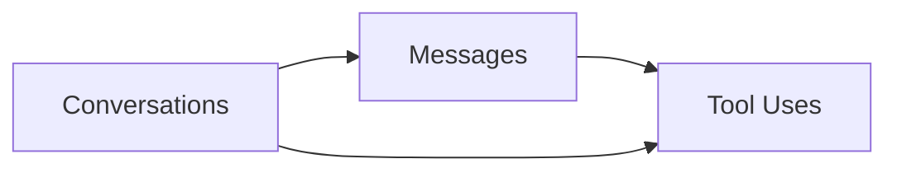

# Database Schema Overview for AI Console Agent

## Introduction

The AI Console Agent uses SQLite to store conversation history, tool interactions, and performance metrics. This document details the database structure, interfaces, and usage patterns for developers.

## Database Version

Current database version: 6
Location: `~/.ai-console-agent/chat_history.db`

## Schema Structure

### 1. Conversations Table

Primary storage for user-agent interactions:

```sql
CREATE TABLE conversations (
    id INTEGER PRIMARY KEY AUTOINCREMENT,
    userQuery TEXT NOT NULL,          -- Original user input
    response TEXT DEFAULT NULL,       -- Final agent response
    title TEXT DEFAULT '',           -- Conversation summary
    timestamp BIGINT NOT NULL,       -- Start time (ms since epoch)
    totalTime INTEGER,               -- Total duration (ms)
    userFeedback REAL DEFAULT 0.5,     -- User rating (0-1)
    correctness REAL DEFAULT 0.5,      -- Accuracy score
    faithfulness REAL DEFAULT 0.5,     -- Query match score
    relevancy REAL DEFAULT 0.5,        -- Relevance score
    lastRetrieved INTEGER DEFAULT null,  -- Last access time
    retrievalCount INTEGER DEFAULT 0     -- Usage count
);
```

### 2. Messages Table

Sequential record of conversation steps:

```sql
CREATE TABLE messages (
    id INTEGER PRIMARY KEY AUTOINCREMENT,
    conversationId INTEGER NOT NULL,   -- Reference to conversations table
    stepNumber INTEGER NOT NULL,       -- Order in conversation
    content TEXT NOT NULL,             -- Message content
    timestamp BIGINT NOT NULL,         -- Creation time (ms since epoch)
    duration INTEGER NOT NULL,         -- Processing time (ms)
    role TEXT NOT NULL,                -- Message sender (user/agent/system)
    FOREIGN KEY (conversationId) REFERENCES conversations (id)
);
```

### 3. Tool Uses Table

Records of command and tool executions:

```sql
CREATE TABLE tool_uses (
    id INTEGER PRIMARY KEY AUTOINCREMENT,
    conversationId INTEGER NOT NULL,    -- Reference to conversations table
    stepId INTEGER NOT NULL,            -- Reference to messages table
    toolName TEXT NOT NULL,             -- Tool identifier
    inputParams TEXT NOT NULL,          -- Tool parameters (JSON)
    output TEXT NOT NULL,               -- Execution result
    timestamp BIGINT NOT NULL,          -- Execution time (ms since epoch)
    duration INTEGER NOT NULL,          -- Execution duration (ms)
    FOREIGN KEY (stepId) REFERENCES messages (id),
    FOREIGN KEY (conversationId) REFERENCES conversations (id)
);
```

## Data Flow and Relationships

### Data Structure



### Flow Description

1. Each conversation starts with user input
2. Multiple messages are recorded in sequence:
   - User queries
   - Agent responses
   - System messages
3. Tool uses are linked to specific messages
4. Performance metrics and scores are updated throughout

## TypeScript Interfaces

```typescript
interface ConversationScores {
  userFeedback: number; // User rating (0-1)
  correctness: number; // Response accuracy (0-1)
  faithfulness: number; // Query match quality (0-1)
  relevancy: number; // Response relevance (0-1)
}

interface ConversationMetadata extends ConversationScores {
  timestamp: number; // Conversation start time
  retrievalCount: number; // Times this conversation was referenced
  lastRetrieved: number | null; // Last access timestamp
}

interface Conversation extends ConversationMetadata {
  id: number; // Unique identifier
  userQuery: string; // Original user input
  title: string; // Conversation summary
  totalTime: number; // Total processing time
  response: string | null; // Final agent response
}

interface ToolCallRecord {
  id: number; // Unique identifier
  stepId: number; // Reference to message
  toolName: string; // Tool identifier
  inputParams: string; // Tool parameters (JSON)
  output: string; // Execution result
  timestamp: number; // Execution time
  duration: number; // Processing time
}
```

## Key Operations

### Inserting Data

```typescript
insertConversation(db, userQuery, startTime): Promise<number>
insertMessage(db, conversationId, stepNumber, content, duration, role): Promise<number>
insertToolUse(db, conversationId, stepId, toolName, inputParams, output, duration, timestamp): Promise<number>
```

### Retrieving Data

```typescript
getConversation(db, conversationId): Conversation | undefined
getAllConversations(db): Conversation[]
getAllConversationData(db, conversationId): {
    messages: AgentMessage[];
    toolCalls: ToolCall[];
    conversationData: ConversationMetadata & { userQuery: string };
}
```

### Updating Data

```typescript
updateConversationFields(db, {
    conversationId,
    title,
    totalTime,
    correctness,
    faithfulness,
    relevancy,
    retrievalCount,
    userFeedback,
    lastRetrieved,
    response
}): Promise<void>
```

## Development Guidelines

### 1. Time Handling

- All timestamps use milliseconds since epoch
- Store as BIGINT in database
- Use `Date.now()` for consistency
- Duration fields measure processing time in milliseconds

### 2. Performance Metrics

- Track duration for all operations
- Monitor conversation retrieval patterns
- Record tool execution times
- Maintain scoring system accuracy

### 3. Data Validation

- Verify foreign key relationships
- Ensure required fields are present
- Validate score ranges (0-1)
- Check timestamp consistency

### 4. Error Handling

- Handle missing conversations gracefully
- Validate input types
- Use try-catch for database operations
- Log database errors appropriately

## Scoring System

The database implements four quality metrics, each ranging from 0 to 1:

1. **User Feedback** (userFeedback)

   - Direct user ratings
   - Default: 0.5

2. **Correctness Score** (correctness)

   - Measures response accuracy
   - Default: 0.5

3. **Faithfulness Score** (faithfulness)

   - Alignment with user queries
   - Default: 0.5

4. **Relevancy Score** (relevancy)
   - Response usefulness
   - Default: 0.5
